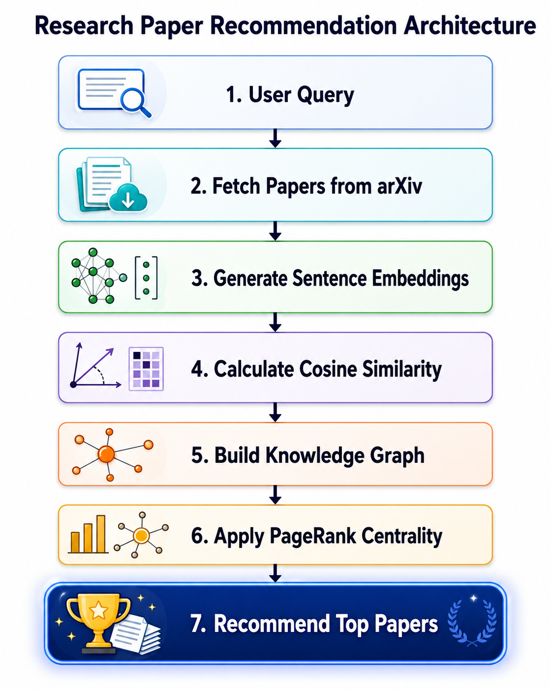
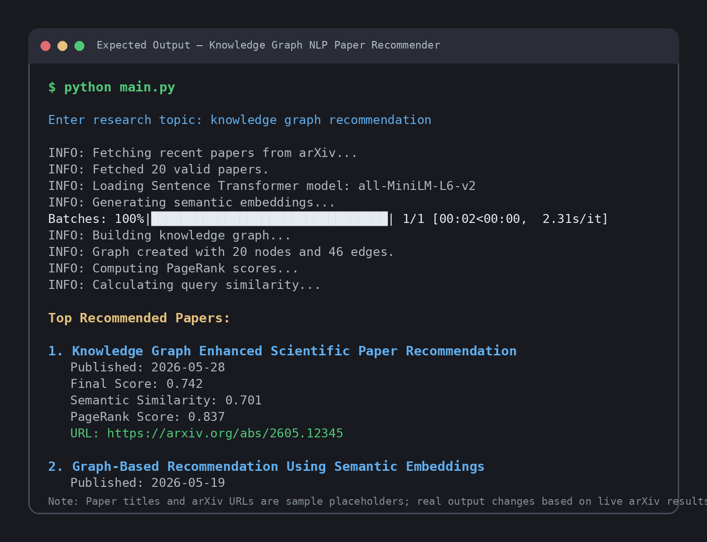

# Knowledge Graph + NLP Paper Recommender

## Overview

This project implements a hybrid AI system for scientific paper recommendation by combining:

- Natural Language Processing (NLP)
- Knowledge Graph Analysis
- Graph-Based Ranking Algorithms
- Semantic Similarity using Transformer Embeddings
- Live research paper retrieval from arXiv

The system fetches recent scientific papers from arXiv based on a user query, analyzes paper abstracts, generates semantic embeddings, constructs a graph representation of relationships between papers, and ranks relevant papers using a hybrid scoring mechanism.

This project was developed to explore practical applications of:

- Knowledge Graphs
- Scientific Literature Analysis
- NLP-based Semantic Search
- Graph-Based Ranking
- AI for Research Analytics

---

## Key Features

- Fetches recent research papers directly from arXiv
- Semantic similarity analysis using transformer embeddings
- Knowledge graph construction using NetworkX
- Graph-based ranking with PageRank
- Hybrid recommendation scoring using semantic similarity and graph importance
- Modular Python implementation with logging and exception handling
- Research-oriented AI pipeline
- Lightweight and easy to extend

---

## Technologies Used

| Technology | Purpose |
|---|---|
| Python | Core development |
| arXiv API | Research paper retrieval |
| Sentence-Transformers | Semantic embeddings |
| NetworkX | Graph construction and analysis |
| Scikit-learn | Cosine similarity computation |
| Pandas | Data handling |
| Logging | Runtime monitoring and debugging |

---

## System Architecture



---

## Expected Output



---

## Repository Structure

```text
Knowledge-Graph-NLP-Paper-Recommender/
│
├── main.py
├── requirements.txt
├── images/
│   ├── architecture.png
│   └── output.png
└── README.md```

---

# Installation Instructions

## 1. Clone Repository

```bash
git clone https://github.com/muhammadumairka/Knowledge-Graph-NLP-Paper-Recommender.git
cd Knowledge-Graph-NLP-Paper-Recommender
```

---

## 2. Create Virtual Environment (Optional but Recommended)

### Windows

```bash
python -m venv venv
venv\Scripts\activate
```

### Linux / Mac

```bash
python3 -m venv venv
source venv/bin/activate
```

---

## 3. Install Dependencies

```bash
pip install -r requirements.txt
```

---

## 4. Run the Project

```bash
python main.py
```

---

# Sample Input

```text
Enter research topic:
Machine learning in healthcare
```

---

# Sample Output

```text
INFO: Fetching recent papers from arXiv...
INFO: Fetched 20 valid papers.
INFO: Loading Sentence Transformer model: all-MiniLM-L6-v2
INFO: Generating semantic embeddings...
INFO: Building knowledge graph...
INFO: Graph created with 20 nodes and 45 edges.
INFO: Computing PageRank scores...
INFO: Calculating query similarity...

Top Recommended Papers:

1. Example Paper Title
   Published: 2026-06-01
   Final Score: 0.742
   Semantic Similarity: 0.813
   PageRank Score: 0.054
   URL: https://arxiv.org/abs/xxxx.xxxxx
```

---

# Methodology

The recommendation workflow follows these stages:

1. A user enters a research topic.
2. Recent research papers are fetched from arXiv.
3.  Paper titles, abstracts, publication dates, and URLs are extracted.
4. Transformer-based sentence embeddings are generated from paper abstracts.
5. Cosine similarity is computed between papers.
6. A semantic knowledge graph is constructed where papers are nodes and similarity-based relationships are edges.
7. PageRank is applied to estimate graph-based importance.
8. Semantic similarity and PageRank scores are combined using a weighted hybrid ranking formula.
9. Top-ranked papers are returned as recommendations.


Ranking Formula

The final recommendation score is calculated as:

```
Final Score = 0.70 × Semantic Similarity + 0.30 × PageRank Score
```
This hybrid ranking approach balances relevance to the user query with graph-based importance within the retrieved paper network.
---

# Research Motivation

Scientific literature is growing rapidly, making it difficult for researchers to identify influential and relevant papers efficiently.

This project explores how:

* NLP
* Semantic embeddings
* Graph analysis
* Knowledge extraction

can be integrated into intelligent research-support systems.

---

# Research Contribution

This project demonstrates how semantic embeddings and graph-based ranking can be integrated into a unified recommendation framework for scientific literature discovery.

The work builds upon the author's research interests in:
- Knowledge Graphs
- Scientific Literature Analysis
- Information Retrieval
- Natural Language Processing
- AI for Research Analytics

---

# Future Work

Planned improvements include:

* Integration with Large Language Models (LLMs)
* Expansion to Semantic Scholar and OpenAlex datasets
* Graph Neural Networks (GNNs)
* Interactive web interface
* Multi-language scientific recommendation support
* Citation prediction and trend analysis
* Retrieval-Augmented Generation (RAG) integration
* Evaluation using Precision@K, Recall@K, MRR, and NDCG

---

# Author

Muhammad Umair

Machine Learning Researcher | Knowledge Graphs | NLP | Scientific Literature Analysis | Generative AI

GitHub: [https://github.com/muhammadumairka](https://github.com/muhammadumairka)
